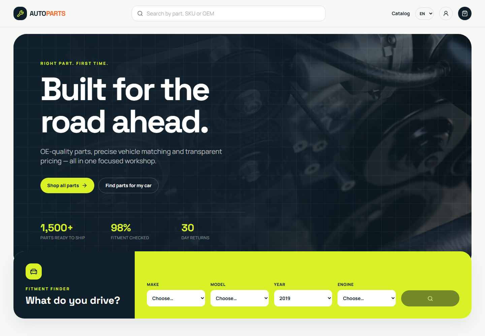
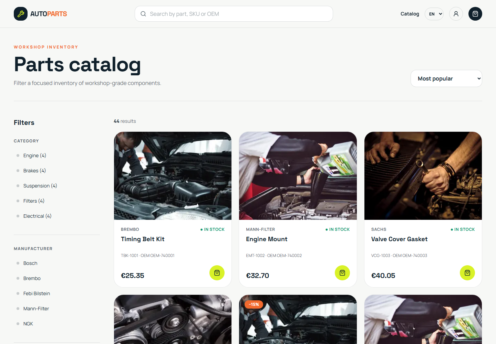
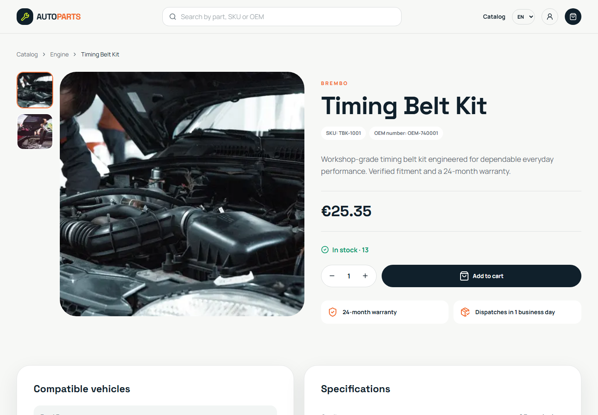
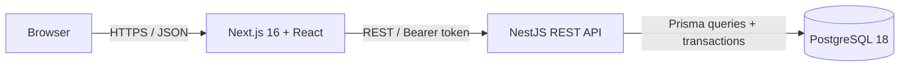
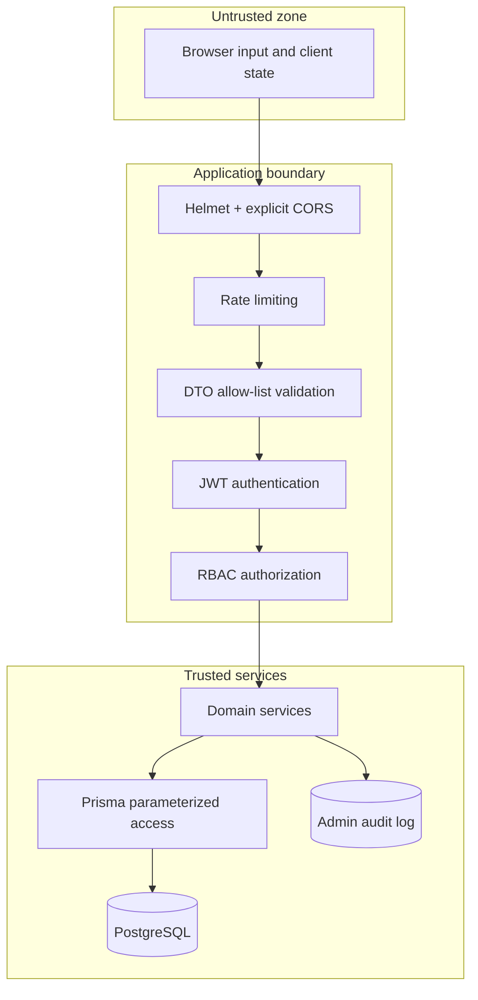
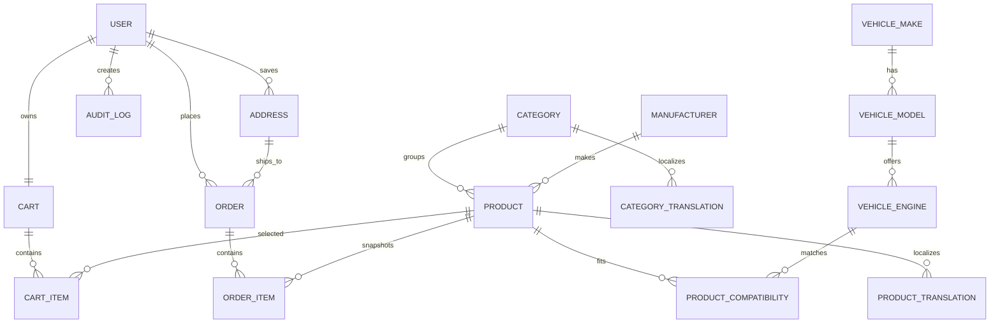

# AutoParts Store

A production-minded, multilingual automotive parts marketplace built as a modular monolith. It combines a responsive storefront, precise vehicle fitment, secure account and order flows, and an operations dashboard backed by a real PostgreSQL data model.

> Portfolio project: payments, products and accounts are demonstration data. The checkout never requests or stores real card details.



## Project overview

AutoParts Store models the parts-buying journey from both sides of the counter. A driver can search by product name, SKU, OEM number or manufacturer; narrow the catalog by vehicle, price and availability; maintain a server-persisted cart; and place a transactionally consistent order. An administrator can manage the catalog and fitment data, watch inventory, inspect users and move orders through a controlled lifecycle.

The repository intentionally uses a modular monolith: the domains are isolated, but deployment and local development remain understandable for a small product team.

## Features

- English, Ukrainian and Russian storefronts with route-based locale switching
- Localized interface, product/category copy, order states, validation feedback and admin labels
- Make → model → year → engine fitment finder with many-to-many product compatibility
- Search across name, SKU, OEM and manufacturer, including debounced suggestions
- Category, manufacturer, vehicle, price, stock and discount filters with sorting and pagination
- Product gallery, specifications, fitment list, sale pricing and related products
- Registration, login, logout, refresh-token rotation and password-reset architecture
- Persistent user carts with stock validation and server-calculated totals
- Transactional checkout, immutable order-line snapshots and an explicit demo payment provider
- User profile and order history
- Admin metrics, recent orders, low-stock alerts, CRUD/deactivation operations and audit history
- Swagger/OpenAPI, Docker Compose, Prisma migrations, deterministic seed data and GitHub Actions

## Screenshots

| Home and fitment | Catalog |
| --- | --- |
|  |  |



## Architecture



The API is split into domain modules: `auth`, `users`, `catalog`, `vehicles`, `cart`, `orders` and `admin`. Each module owns its HTTP contract and business rules. Prisma is the single database boundary; the frontend never talks to PostgreSQL or calculates authoritative prices.

### Security boundaries



See [architecture notes](./docs/architecture.md) and the [security model](./docs/security.md).

## Tech stack

| Layer | Technology |
| --- | --- |
| Web | Next.js 16, React 19, TypeScript, Tailwind CSS, Lucide |
| API | NestJS 11, TypeScript, Passport JWT, class-validator |
| Data | PostgreSQL 18, Prisma ORM |
| Security | bcrypt, rotating JWT sessions, Helmet, CORS, throttling, RBAC |
| Tooling | npm workspaces, Jest, ESLint, Docker Compose, GitHub Actions |

## Database architecture



Important invariants:

- Product price, discount and stock are trusted only from PostgreSQL.
- Stock decrement, address creation, order creation and cart clearing share one transaction.
- `OrderItem` stores purchase-time SKU, name and price snapshots.
- Translations use one row per stable entity and locale; adding a locale does not duplicate products.
- A compatibility record includes an engine and valid year range, so one part can fit many vehicles.

## API

Swagger UI is served at [http://localhost:4000/api/docs](http://localhost:4000/api/docs) and the health endpoint at `/api/health`.

Primary resource groups:

```text
/api/auth          registration, sessions, password reset
/api/users         profile and admin user view
/api/products      catalog, search, suggestions and mutations
/api/categories    localized category management
/api/manufacturers manufacturer management
/api/vehicles      hierarchy and product compatibility
/api/cart          persistent cart operations
/api/orders        checkout, history and lifecycle
/api/admin         metrics and audit log
```

The full query and access summary is in [docs/api.md](./docs/api.md).

## Security

- Passwords use bcrypt with cost factor 12; plaintext credentials are never persisted.
- Access and refresh tokens use independent secrets and expirations.
- Refresh tokens are rotated, sent through `HttpOnly` cookies and stored only as SHA-256 digests.
- Global backend guards enforce authentication and ADMIN permissions; hidden UI controls are not a security boundary.
- `ValidationPipe` strips unknown fields and rejects non-allow-listed input.
- Sensitive auth and password-reset routes have stricter rate limits.
- Helmet, an explicit CORS allow-list and sanitized error responses reduce common web attack surface.
- Prisma parameterizes queries; search terms never become SQL fragments.
- Admin product and order changes are written to `AuditLog`.
- The committed dependency tree passes `npm audit` with zero known vulnerabilities at the time of verification.

## Internationalization

Routes begin with `/en`, `/uk` or `/ru`. UI dictionaries live in `frontend/src/lib/i18n.ts`; database-backed names and descriptions use `ProductTranslation` and `CategoryTranslation` rows keyed by the Prisma `Locale` enum. The API accepts a `locale` query parameter and falls back to English when a translation is absent.

To add a language, extend the frontend locale registry and dictionary, add the locale to the Prisma enum, migrate, and seed the corresponding translation rows. No translation service runs during requests.

## Docker setup

Requirements: Docker Engine with Compose v2.

```bash
cd projects/autoparts-store
cp .env.example .env
# Replace the PostgreSQL password and both JWT secrets in .env.
docker compose up --build -d
docker compose exec backend npm run prisma:seed
```

Open:

- Storefront: `http://localhost:3000/en`
- REST API: `http://localhost:4000/api`
- Swagger: `http://localhost:4000/api/docs`

Stop the stack with `docker compose down`. Add `-v` only when you intentionally want to remove the local database volume.

## Local development

Requirements: Node.js 22+, npm 11+, and PostgreSQL 16+.

```bash
cd projects/autoparts-store
npm install
cp .env.example .env
# Point DATABASE_URL at your PostgreSQL instance and replace all placeholder secrets.
npm run prisma:generate
npm run db:migrate
npm run db:seed
npm run dev
```

The web app runs on port 3000 and NestJS on port 4000.

### Demo users

| Role | Email | Password |
| --- | --- | --- |
| User | `user@autoparts.demo` | `UserDemo123!` |
| Admin | `admin@autoparts.demo` | `AdminDemo123!` |

These accounts are created only by the demo seed. Override `SEED_USER_PASSWORD` and `SEED_ADMIN_PASSWORD` before seeding any shared environment.

## Environment variables

| Variable | Purpose |
| --- | --- |
| `DATABASE_URL` | PostgreSQL connection string |
| `POSTGRES_DB`, `POSTGRES_USER`, `POSTGRES_PASSWORD` | Compose database bootstrap |
| `JWT_ACCESS_SECRET` | Access-token signing key, 32+ characters |
| `JWT_REFRESH_SECRET` | Independent refresh-token key, 32+ characters |
| `ACCESS_TOKEN_TTL`, `REFRESH_TOKEN_TTL` | Session lifetimes |
| `FRONTEND_URL` | Allowed CORS origin(s) |
| `NEXT_PUBLIC_API_URL` | Browser-visible REST API base URL |
| `PORT` | NestJS port |

Only `.env.example` is committed. `.env`, database data, logs, builds and dependency folders are ignored.

## Testing

```bash
npm run lint
npm run typecheck
npm test
npm run build
npm audit
```

The focused Jest suite covers password/auth failure behaviour, backend RBAC, Prisma catalog filter construction, cart money calculations and valid/invalid order status transitions. The application was additionally smoke-tested against PostgreSQL through login → cart → demo checkout → order status update, including a negative USER → admin route check.

## CI/CD

`.github/workflows/ci.yml` runs on pushes and pull requests to `main`:

1. deterministic `npm ci`;
2. Prisma client generation;
3. lint;
4. typecheck;
5. Jest;
6. backend and frontend production builds.

The workflow has read-only repository permissions and uses non-production build placeholders rather than repository secrets.

## Project structure

```text
autoparts-store/
├── backend/
│   ├── prisma/              schema, migration and deterministic seed
│   ├── src/common/          guards, decorators, filters and audit service
│   ├── src/modules/         domain modules
│   └── test/                focused unit tests
├── frontend/
│   ├── src/app/[locale]/    localized App Router pages
│   ├── src/components/      storefront and admin UI
│   └── src/lib/             API client, locale data and shared types
├── docs/                    architecture, API and security notes
├── screenshots/             verified interface captures
├── docker-compose.yml
├── .env.example
└── README.md
```

## Future improvements

- PostgreSQL full-text/trigram indexes for larger catalogs
- Address book management and shipment tracking webhooks
- Email delivery for password resets and order events
- Object storage plus an image-processing pipeline
- E2E coverage with Playwright and disposable test containers
- Inventory reservations for long-running external payment authorization
- Accessible combobox primitives and broader keyboard-flow testing
- Observability with OpenTelemetry traces, structured logs and SLO dashboards

## License

Released under the [MIT License](../../LICENSE).
