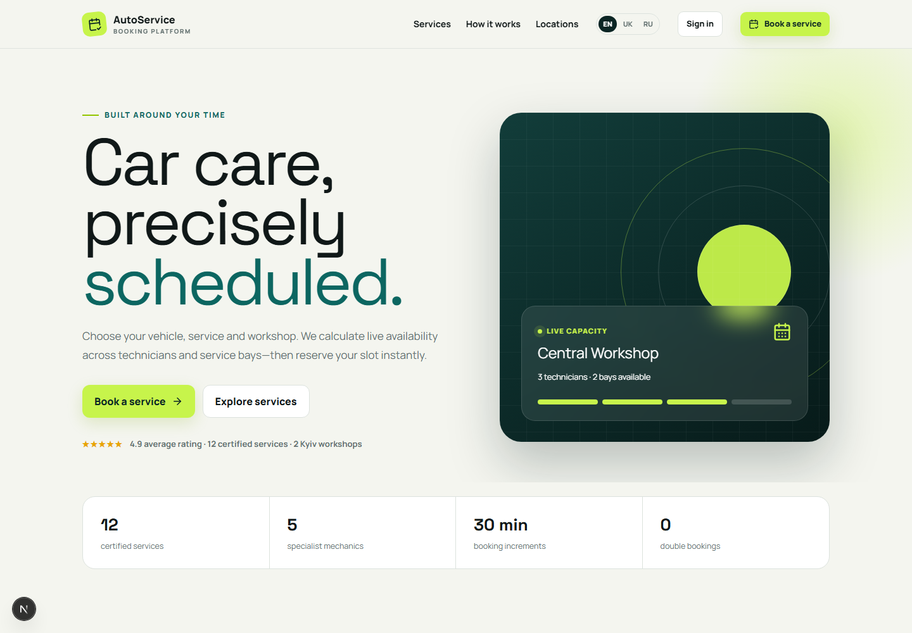
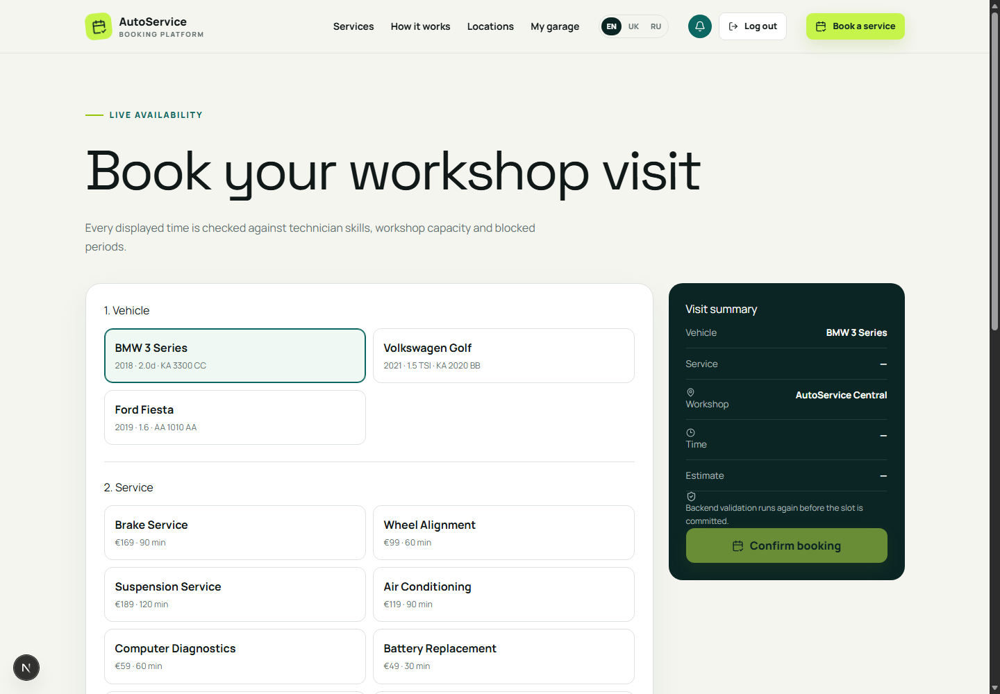
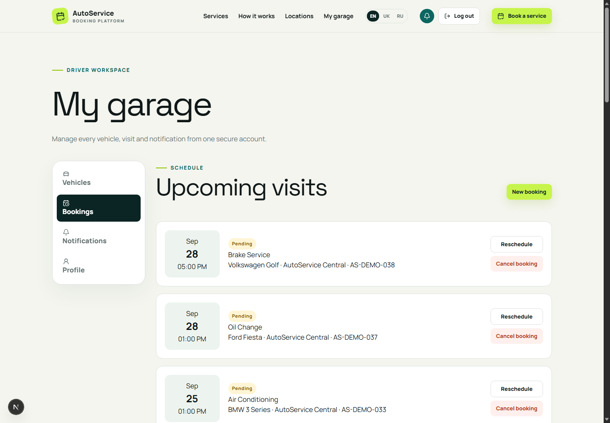
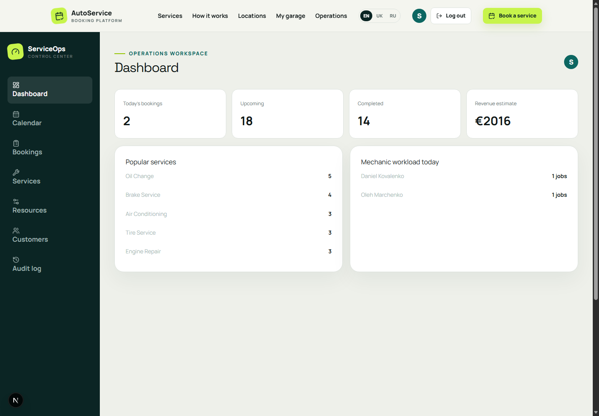
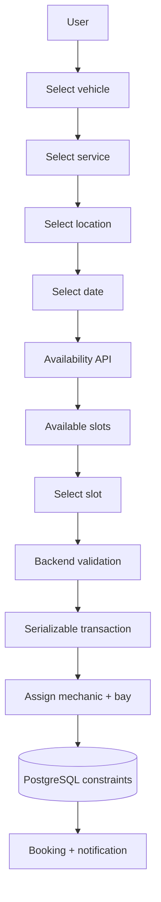
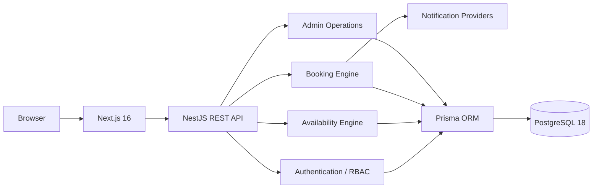

# AutoService Booking

A production-minded, multilingual automotive workshop scheduling and operations platform. It combines a polished customer journey with a real resource-aware booking engine, secure account management, in-app notifications and an administrative calendar.

> Portfolio demo: prices, customers and appointments are demonstration data. The application never requests real payment details.

## Demo

| Role | Email | Password |
| --- | --- | --- |
| User | `user@autoservice.demo` | `UserDemo123!` |
| Admin | `admin@autoservice.demo` | `AdminDemo123!` |

## Features

- English, Ukrainian and Russian routes with extensible dictionary-based UI translations
- Registration, login, logout, rotating refresh token and password-reset architecture
- Customer garage with multiple vehicles, profile and in-app notification inbox
- Six-step booking flow: vehicle → service → location → date → live slot → confirmation
- Duration-aware availability calculated from schedules, holidays, blocks, mechanics, skills and service bays
- Atomic booking and rescheduling with race-condition protection
- Cancellation reason and timestamp, booking history and explicit lifecycle states
- Operations dashboard with KPIs, day/week/month calendar, filters and booking details
- Admin status transitions, technician and service-bay assignment, services, hours, blocks, customers and audit log
- 12 localized services, two workshops, five mechanics, six service bays and 30+ seeded bookings
- Swagger/OpenAPI, Docker Compose, Prisma migrations, integration tests and GitHub Actions

## Screenshots

| Customer home | Booking engine |
| --- | --- |
|  |  |

| My Garage | Admin dashboard |
| --- | --- |
|  |  |

## Booking flow



## Architecture



The application is a modular monolith: domain modules have explicit boundaries while deployment stays straightforward. See [architecture notes](./docs/architecture.md).

## How double booking is prevented

1. The API starts a `SERIALIZABLE` transaction.
2. A PostgreSQL advisory lock serializes allocation for one location and date.
3. The engine re-reads overlapping active bookings and blocks.
4. It assigns a qualified free mechanic and active service bay.
5. PostgreSQL `EXCLUDE USING gist` constraints reject overlapping active ranges for both resources.

The exclusion constraints are a final invariant even when multiple API instances race. An integration test launches two concurrent requests for the last slot and asserts that exactly one succeeds.

## Tech stack

| Layer | Technology |
| --- | --- |
| Web | Next.js 16, React 19, TypeScript, Tailwind CSS 4, Lucide |
| API | NestJS 11, TypeScript, Passport JWT, class-validator, Swagger |
| Data | PostgreSQL 18, Prisma ORM, GiST exclusion constraints |
| Security | bcrypt, rotating JWT sessions, Helmet, CORS, throttling, RBAC |
| Delivery | Docker Compose, npm workspaces, Jest, GitHub Actions |

## Database

Core entities are `User`, `Vehicle`, `Service`, `ServiceTranslation`, `Location`, `Mechanic`, `ServiceBay`, `BusinessHours`, `SpecialWorkingDay`, `BlockedPeriod`, `Booking`, `BookingStatusHistory`, `Notification` and `AuditLog`.

Indexes cover location/time, resource/time, customer history and status calendar queries. Bookings keep their quoted price and resource assignments. All timestamps are stored as UTC.

## API

Swagger UI: [http://localhost:4100/api/docs](http://localhost:4100/api/docs)

Primary groups:

```text
/api/auth              accounts and sessions
/api/users             profile and customer administration
/api/vehicles          customer-owned vehicles
/api/services          localized service catalog
/api/locations         workshops and public schedules
/api/availability      calculated calendar and slots
/api/bookings          booking lifecycle and admin operations
/api/notifications     in-app inbox
/api/admin             KPIs, resources, hours, blocks and audit
```

See the [API summary](./docs/api.md).

## Authentication and security

Access tokens are short-lived bearer tokens. Refresh tokens rotate through `HttpOnly` cookies and only their SHA-256 digests are stored. Passwords use bcrypt. Global validation, explicit CORS, Helmet, throttling, sanitized errors, backend ownership checks and role guards protect the API. Administrative mutations are audited.

The detailed threat boundaries are in [security.md](./docs/security.md).

## Internationalization

Routes begin with `/en`, `/uk` or `/ru`. UI dictionaries live in `frontend/src/lib/i18n.ts`; service names and descriptions are normalized in `ServiceTranslation` rows keyed by the Prisma `Locale` enum. Adding a locale requires a dictionary, route entry, enum migration and translated seed rows—not duplicated services.

## Docker

Requirements: Docker Engine with Compose v2.

```bash
cp .env.example .env
# Replace the PostgreSQL password and both JWT secrets.
docker compose up --build -d
docker compose exec backend npm run prisma:seed
```

Open the customer app at [http://localhost:3100/en](http://localhost:3100/en).

## Local installation

Requirements: Node.js 22+, npm 11+ and PostgreSQL 16+.

```bash
npm install
cp .env.example .env
npm run prisma:generate
npm run db:migrate
npm run db:seed
npm run dev
```

Frontend runs on `3100`; API runs on `4100`.

## Environment variables

| Variable | Purpose |
| --- | --- |
| `DATABASE_URL` | PostgreSQL connection used by Prisma |
| `POSTGRES_DB`, `POSTGRES_USER`, `POSTGRES_PASSWORD` | Compose database bootstrap |
| `JWT_ACCESS_SECRET`, `JWT_REFRESH_SECRET` | Independent signing secrets, minimum 32 characters |
| `ACCESS_TOKEN_TTL`, `REFRESH_TOKEN_TTL` | Session lifetimes |
| `FRONTEND_URL` | Explicit CORS allow-list |
| `NEXT_PUBLIC_API_URL` | Browser-visible API base URL |
| `PORT` | NestJS HTTP port |
| `SEED_USER_PASSWORD`, `SEED_ADMIN_PASSWORD` | Local demo seed only |

## Testing

```bash
npm run lint
npm run typecheck
npm test
npm run build
```

The suite covers password failure, RBAC, vehicle ownership, interval/slot calculation, lifecycle transitions, booking creation under concurrency, rescheduling, cancellation and notification persistence. PostgreSQL integration tests must use an isolated database whose URL contains `autoservice_test`.

## CI/CD

GitHub Actions starts PostgreSQL, installs deterministically, deploys migrations, generates Prisma Client, then runs lint, typecheck, Jest and both production builds on pushes and pull requests.

## Project structure

```text
autoservice-booking/
├── backend/
│   ├── prisma/               schema, migration, deterministic seed
│   ├── src/common/           guards, decorators, audit, error filter
│   ├── src/modules/          domain modules and booking engine
│   └── test/                 unit and PostgreSQL integration tests
├── frontend/
│   └── src/
│       ├── app/[locale]/     localized routes
│       ├── components/       customer and admin interfaces
│       └── lib/              API client, i18n and types
├── docs/
├── screenshots/
├── docker-compose.yml
└── README.md
```

## Future improvements

- Email, SMS and Telegram provider adapters behind the notification interface
- Automated reminder worker with a durable job queue
- Per-location daylight-saving conversion at the calendar input boundary
- Mechanic self-service role and work-order notes
- Parts inventory and service-package composition
- Object storage for inspection photos and documents
- Playwright end-to-end regression suite
- OpenTelemetry traces and booking-capacity SLO dashboards

## License

Released under the repository MIT License.
