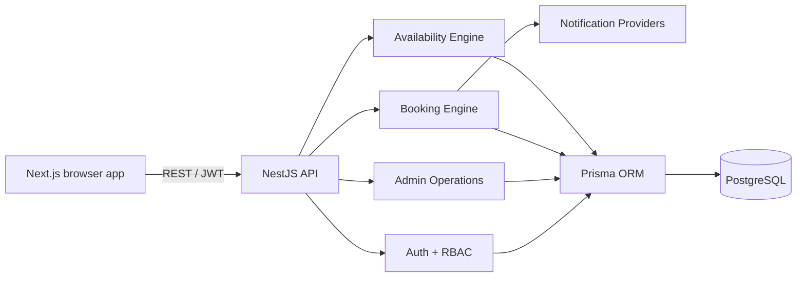

# Architecture

AutoService Booking is a modular monolith. One NestJS process contains independently scoped modules for authentication, customers, vehicles, catalog, availability, bookings, notifications and administration. PostgreSQL is the consistency boundary; Prisma is the only data access layer.

## Booking consistency

Availability shown in the UI is advisory. Creation and rescheduling always re-check the selected interval in a serializable transaction. The transaction obtains a date-and-location advisory lock, queries overlapping bookings and blocked periods, and assigns an available qualified mechanic and service bay. PostgreSQL exclusion constraints independently reject overlapping active bookings for either resource.

The database uses half-open `[start, end)` ranges, allowing one booking to start exactly when another ends.

## Time model

Timestamps are stored in UTC. Each location records an IANA time-zone identifier. The demo calendar submits normalized ISO timestamps; a production deployment can extend the UI formatter for cross-time-zone workshop networks without changing storage or booking constraints.
