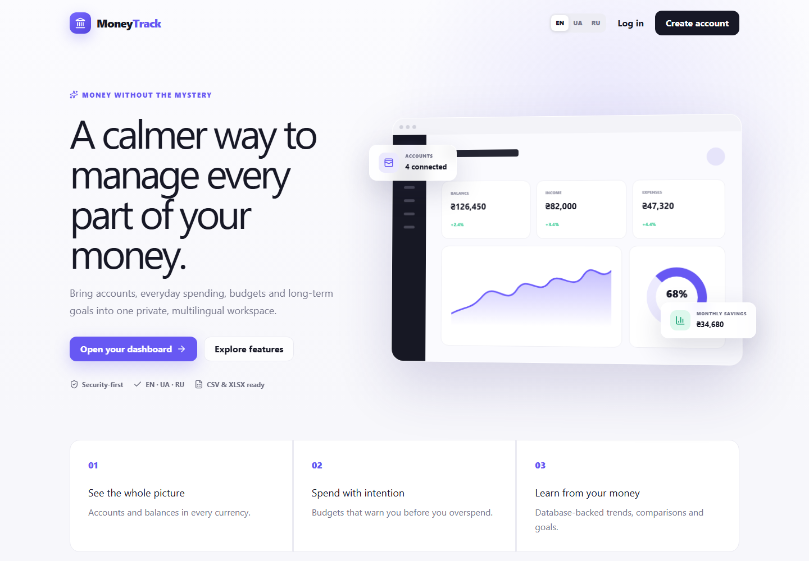
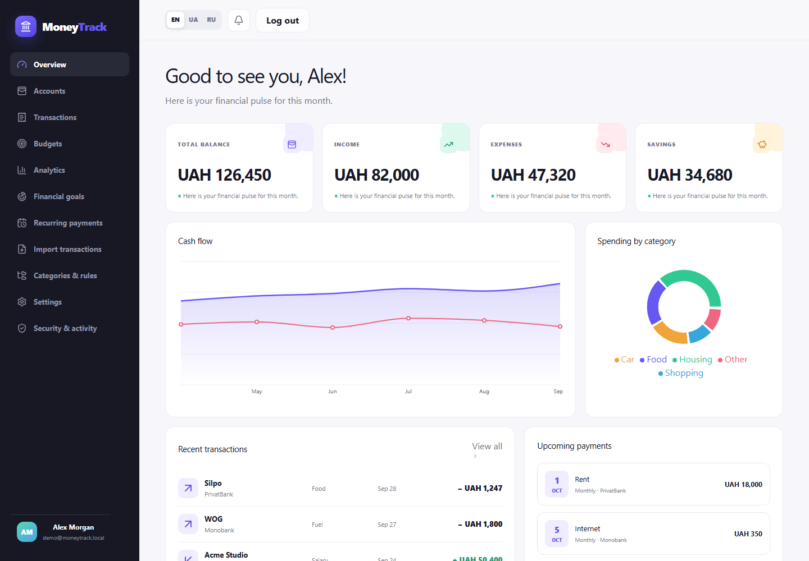
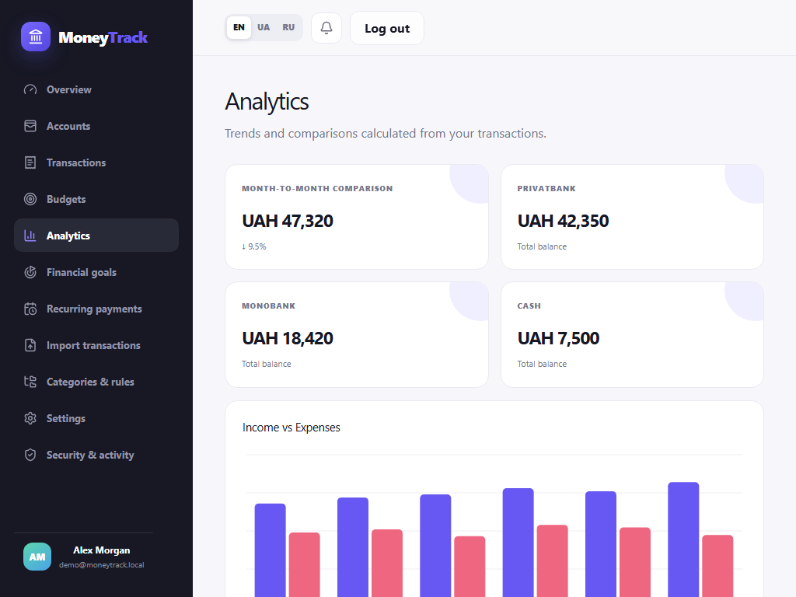
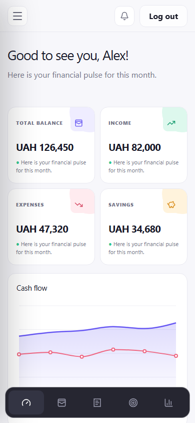
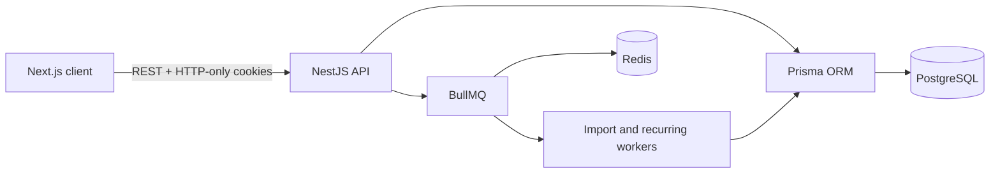

# MoneyTrack

MoneyTrack is a production-style, multilingual personal finance platform for organizing accounts, transactions, budgets, goals, recurring payments, imports, and analytics in one responsive workspace.

It is a portfolio application—not a bank. It never asks for or stores banking passwords, payment-card numbers, CVV codes, or other real banking credentials.

## Highlights

- Multiple UAH, USD, and EUR accounts with balance tracking
- Income, expense, and linked account-transfer workflows
- Searchable, filterable, paginated transaction history
- Monthly and category budgets with configurable threshold alerts
- Database-backed cash-flow, category, balance, savings, and month comparison analytics
- Financial goals with visual progress tracking
- Weekly, monthly, and yearly recurring payments processed through BullMQ
- Safe CSV/XLSX statement preview and background import
- Duplicate detection and priority-based automatic categorization rules
- English, Ukrainian, and Russian UI architecture
- Responsive desktop, tablet, and mobile layouts
- JWT access tokens, refresh-token rotation, HTTP-only cookies, rate limiting, and audit logging

## Screenshots

The screenshots below use seeded demo data only. They show the responsive product UI at the desktop, tablet, and mobile breakpoints.

### Landing page



### Dashboard



### Analytics



### Mobile dashboard



See [screenshots/README.md](./screenshots/README.md) for capture sizes and image details.

## Technology stack

| Layer | Technologies |
| --- | --- |
| Frontend | Next.js 16, React 19, TypeScript, Tailwind CSS 4, Recharts, Lucide |
| Backend | NestJS 11, TypeScript, class-validator, Swagger |
| Data | PostgreSQL, Prisma ORM |
| Jobs | Redis, BullMQ |
| Security | bcrypt, JWT, HTTP-only cookies, Helmet, throttling |
| Import | csv-parse, read-excel-file |
| Infrastructure | Docker, Docker Compose |
| Testing | Jest, ts-jest |

## Architecture



The frontend is organized around locale-prefixed routes and a shared authenticated application shell. The API uses modules for authentication, users, accounts, transactions, categories, budgets, goals, recurring payments, analytics, imports, categorization, and audit activity. Ownership checks are always performed server-side.

Detailed design notes are available in [docs/architecture.md](./docs/architecture.md).

## Database overview

The Prisma schema models:

- `User`, preferences, refresh tokens, notifications, and audit logs
- `Account` and balance-affecting `Transaction` records
- Nested `Category` records with historical transaction preservation
- Monthly `Budget` records and configurable alert thresholds
- `FinancialGoal` progress
- `RecurringPayment` schedules
- `CategorizationRule` priority matching
- `ImportJob` preview, status, and result counts

Transfers use a shared `transferGroupId` across paired transfer records. They update both account balances atomically and are excluded from income and expense analytics.

## Security model

- Passwords are hashed with bcrypt using a work factor of 12.
- Short-lived access tokens and rotated refresh tokens use separate secrets.
- Refresh tokens are SHA-256 hashed before database storage.
- Browser tokens use HTTP-only, `SameSite` cookies; production cookies are secure.
- Global DTO validation rejects unknown fields.
- API rate limiting, Helmet headers, explicit CORS origins, and account ownership checks are enabled.
- Sensitive actions are written to an audit log without storing secrets in metadata.
- Uploaded statements are memory-limited to 5 MB and validated before processing.

MoneyTrack does not claim PCI compliance and must not be used to store real card or bank credentials. See [docs/security.md](./docs/security.md).

## Local setup

Requirements:

- Node.js 22+
- npm 11+
- PostgreSQL 16+
- Redis 7+

```bash
cp .env.example .env
npm install
npm run prisma:generate
npm run db:migrate
npm run db:seed
npm run dev
```

The applications start at:

- Frontend: `http://localhost:3200`
- API: `http://localhost:4200/api`
- Swagger: `http://localhost:4200/api/docs`

### Demo account

The seed creates clearly non-production credentials:

- Email: `demo@moneytrack.local`
- Password: `MoneyTrackDemo123!`

Change `SEED_USER_EMAIL` and `SEED_USER_PASSWORD` before seeding if desired. Never use these credentials in a real deployment.

## Docker

```bash
cp .env.example .env
# Replace all placeholder passwords and JWT secrets in .env.
docker compose up --build
docker compose exec backend npm run prisma:seed -w backend
```

Compose starts the frontend, backend, PostgreSQL, and Redis. The backend deploys committed Prisma migrations before starting.

## Environment variables

| Variable | Purpose |
| --- | --- |
| `DATABASE_URL` | PostgreSQL connection URL |
| `POSTGRES_DB`, `POSTGRES_USER`, `POSTGRES_PASSWORD` | Compose database configuration |
| `REDIS_URL` | BullMQ Redis connection |
| `PORT` | Backend port; default `4200` |
| `FRONTEND_URL` | Allowed CORS origin(s) |
| `NEXT_PUBLIC_API_URL` | Browser-visible API base URL |
| `JWT_ACCESS_SECRET` | Access-token signing secret, at least 32 characters |
| `JWT_REFRESH_SECRET` | Separate refresh-token signing secret, at least 32 characters |
| `ACCESS_TOKEN_TTL`, `REFRESH_TOKEN_TTL` | Token lifetimes |
| `SEED_USER_EMAIL`, `SEED_USER_PASSWORD` | Local demo seed only |

## API overview

The REST API is grouped under:

`/auth`, `/users`, `/accounts`, `/transactions`, `/categories`, `/budgets`, `/goals`, `/recurring-payments`, `/analytics`, `/imports`, `/categorization-rules`, and `/audit-logs`.

Transaction list endpoints support pagination and filters. Imports use an explicit preview/confirm flow, and Swagger documents the running API at `/api/docs`. See [docs/api.md](./docs/api.md).

## Import workflow

1. Upload a CSV or XLSX statement (maximum 5 MB and 10,000 rows).
2. Map or verify Date, Description, Amount, and optional Merchant columns.
3. Review parsed values and row-level validation errors.
4. Confirm the import.
5. A BullMQ worker applies categorization, duplicate fingerprints, transactions, and balances atomically.
6. Review imported, skipped, invalid, or failed counts in import history.

Malformed rows are never silently imported.

## Multilingual support

Routes and UI copy support English (`/en`), Ukrainian (`/ua`), and Russian (`/ru`). English is the default. Navigation, authentication, dashboards, forms, settings, imports, empty states, and error states use centralized dictionaries rather than scattered component strings.

## Responsive design

The layout is designed and checked for 1440 px, 1024 px, 768 px, and 390 px widths:

- Desktop uses a persistent sidebar and multi-column analytics.
- Tablet collapses content into adaptive grids and a compact sidebar.
- Mobile uses a slide-in menu, bottom navigation, stacked cards, compact transaction rows, touch-sized controls, and responsive charts.
- Global horizontal overflow is prevented.

## Testing and quality

```bash
npm run lint
npm run typecheck
npm run test
npm run build
npm audit
```

The backend test suite covers signed balance effects, budget thresholds, division-by-zero-safe comparisons, categorization priority, duplicate fingerprints, and recurring-date calculations.

## Project structure

```text
moneytrack/
├── backend/
│   ├── prisma/              # Schema, migration, and demo seed
│   ├── src/
│   │   ├── common/          # Auth guard, decorators, exception filter
│   │   ├── domain/          # Tested financial calculations
│   │   └── modules/         # REST API and job workers
│   └── test/                # Business-logic tests
├── frontend/
│   ├── public/
│   └── src/
│       ├── app/             # Locale-prefixed Next.js routes
│       ├── components/      # Responsive product UI
│       └── lib/             # API, i18n, and route configuration
├── docs/                    # Architecture, API, and security notes
├── screenshots/             # Capture plan and future assets
├── .env.example
└── docker-compose.yml
```
